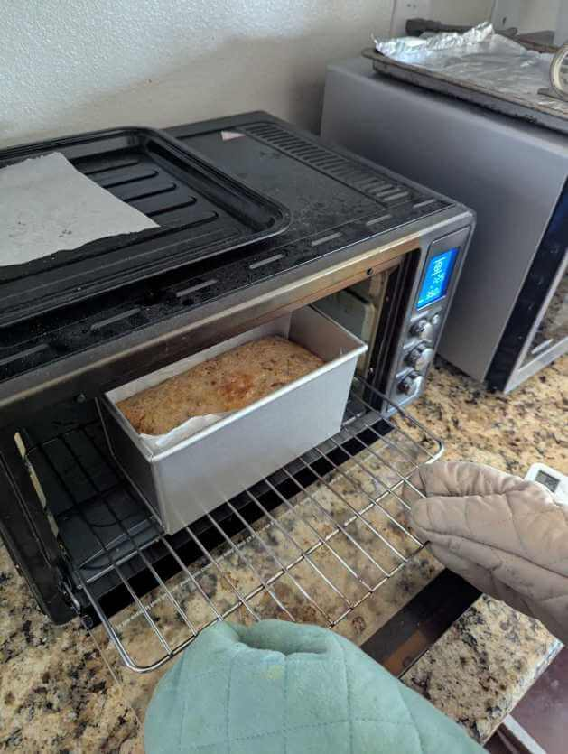
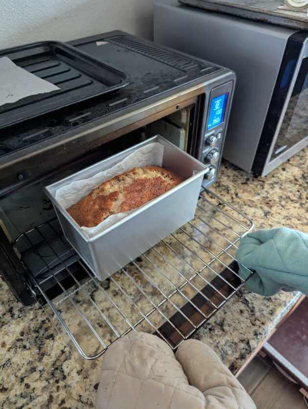

+++
date = '2026-02-19T00:32:53Z'
title = 'Banana Bread'
+++

Here is my mom's base recipe for banana bread

## Wet ingredients

- 2 ripe bananas
- 2 eggs
- 1/2 cup oil
- 1/4 cup milk

Beat together until creamy

## Dry ingredients

- 1 1/4 cup flour
- 1 cup sugar
- 1/2 tsp baking powder
- 1/2 tsp salt

Mix and blend until creamy.
Bake in breadpan at 350 F for 75 minutes.

## 2025-02-11

- We added a quarter cup of chopped pecans, 1/2 tsp of cinnamon, and 1/2 tsp of vanilla extract.
- We scaled the above ingredients up by about 10% because we had an extra egg.
- We made do with a tall bread pan that could only fit in the oven on the bottom rack. Also the bottom had holes so we lined with parchment paper to stop the batter from leaking.
- TIL baking powder has an acidic additive that baking soda lacks, so it works for recipes that don't have acidic ingredients.

